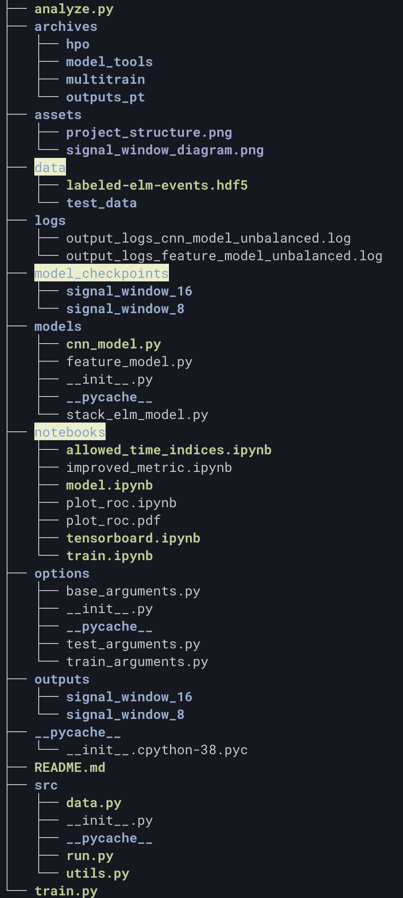

# BES EdgeML project
BES EdgeML project is an effort to develop machine learning (ML) models for the real-time identification of edge-localized-mode (ELM) events and the turbulence properties of confinement regimes using the 2D Beam Emission Spectroscopy (BES) system at DIII-D. The “edge ML” models will be deployed on a high-throughput FPGA accelerator for integration in the real-time plasma control system (PCS).

The whole project can be structured as follows:

    

The code consists of the PyTorch implementations for various models which are located inside the `models/`
`archives/model_tools/` is a Python module and the primary set of tools for training ML models.

- `model_tools/data.py` - Prepare BES data for training runs.  The module looks for BES data in `data/` (ignored
by git).
- `model_tools/model.py` - Specify a model
- `model_tools/train.py` - Train a model.  The trained model is saved in `models/` (ignored by git).
- `model_tools/analyze.py` - Analyze results of a trained model

`archives/hpo/` is a directory with python modules and Slurm scripts to perform hyper-parameter optimization with Optuna

- `hpo/hpo-sbatch.sh` - Slurm script.  Calls `hpo/hpo-create.py`.
- `hpo/hpo-create.py` - Create Optuna "study" and launch parallel processes that call `hpo/hpo-launch.py`.
- `hpo/hpo-launch.py` - Run trials in a single process.
- `hpo/hpo-check.py` - Check and plot results/status of a study.

`archives/multitrain/` - Out-of-date but similar to `hpo/`.  The scripts and python modules in `multi-train/` are intended
to perform multiple training runs for a single set of model parameters, for example, the "best" parameters from HPO.

`notebooks/` - Out-of-date notebooks from earlier development.
