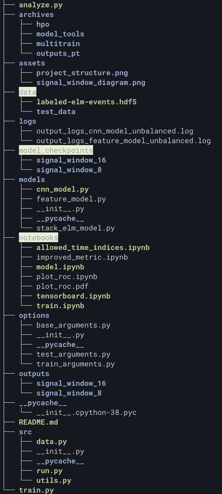
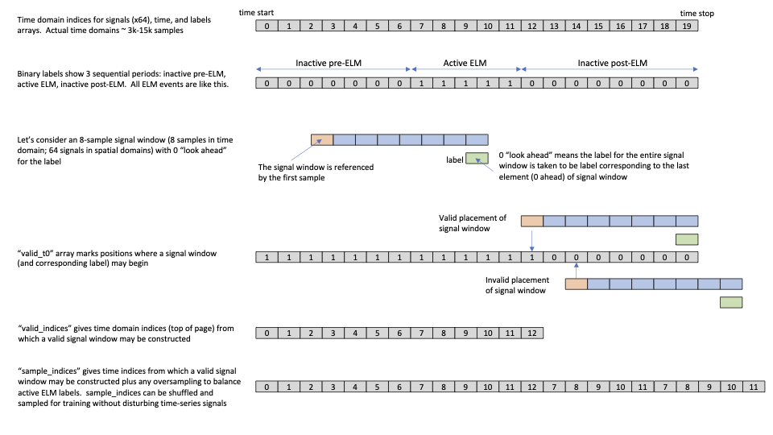

# BES EdgeML project
BES EdgeML project is an effort to develop machine learning (ML) models for the real-time identification of edge-localized-mode (ELM) events and the turbulence properties of confinement regimes using the 2D Beam Emission Spectroscopy (BES) system at DIII-D. The “edge ML” models will be deployed on a high-throughput FPGA accelerator for integration in the real-time plasma control system (PCS).

The whole project can be structured as follows:
<p align='center'>
    
</p>

The code consists of the PyTorch implementations for various models which are located inside the `models/` directory.

`notebooks/` directory contains various jupyter notebooks which are used for experimentation with the data preprocessing pipelines and calculating ROC plots.

`src/` directory contains scripts for various utility functions, data preprocessing and boilerplate code used for training and evaluation. One of the key features of the data preprocessing pipelines is the way inputs and labels are created. Inputs are 3D-tensors where the leading dimension contains time-steps according to `signal_window_size` and the last two dimensions contain `8x8` BES spatial data comprising the output from the 64 channels of the detector. This can be understood in more detail by the following fantastic figure created by Dr. David Smith.

<p align='center'>
    
</p>

`options/` directory contains helper classes for various command line arguments which can be used to change the various parameters ranging from data-preprocessing to model training and inference.

`model_checkpoints/` contains the saved models which can be used for inference.

`archives/` directory contains previous code files which are implemented in TensorFlow. It also contains plots generated earlier using PyTorch. It is just for reference and is not in active development.
`archives/model_tools/` is a Python module and the primary set of tools for training ML models. `archives/hpo/` is a directory with python modules and Slurm scripts to perform hyper-parameter optimization with Optuna. `archives/multitrain/` is out-of-date but similar to `hpo/`.  The scripts and python modules in `multi-train/` are intended
to perform multiple training runs for a single set of model parameters, for example, the "best" parameters from HPO.

`train.py` and `analyze.py` are the main scripts used for training and inference. 

## Getting started
There are certain command line arguments which should be passed along with the training script. You can find more help about these by running
```
python train.py --help
```
or 
```
python analyze.py --help
```
### Train the model
Training a model can be easily done by running something like (from the project directory) -
```
python train.py --model_name cnn --n_epochs 5 --signal_window_size 16 --label_look_ahead 0 --scheduler CyclicLR --num_workers 4
```

`train.py` script expects the input `.hdf5` file to be stored in the `data/` directory 

### Test the model
Testing can be done similarly -
```
python analyze.py --model_name cnn --signal_window_size 16 --output_dir outputs --threshold 0.45 --plot_data --show_metrics
```

If you just want to run `train.py` and `analyze.py` without saving any output files or plots, you can just add the flag `--dry_run` to either of the scripts.